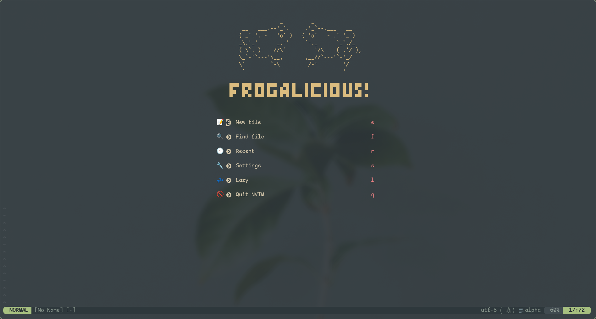

# Minh's Neovim Configuration

This repository contains the configurations for my customized NeoVim experience :D



## Why Move Away from COC.nvim? 

There's no DAP protocal for COC.nvim, and I really wanted that.
I want to be able to use NeoVim while I'm at university, which includes
being able to debug code while I'm in the editor as well.


### For Those Using my coc.nvim Config

It'll be another tag that you can fork from, no worries!


## Getting Started

### Required Software

You'll need `git`, `nodjs/npm`, and `python3-venv` for this configuration to work properly.

### Backing Up Your Configuration

> Note: 'backing up' in this context just means renaming
> those directories.

Before you go ahead and clone this configuration onto your machine, it's *recommended*
for you to first backup your own NeoVim configuration. Below are a list of directories
to back up:

**Linux**

- `$HOME/.config/nvim/`
- `$HOME/.local/share/nvim`
- `$HOME/.cache/nvim`

**Windows**

- `C:\Users\[your-username]\AppData\Local\nvim`
- `C:\Users\[your-username]\AppData\Local\nvim-data`

For example, you'd run these commands to back up on Linux:

```sh
mv $HOME/.config/nvim $HOME/.config/nvim.bak
mv $HOME/.local/share/nvim $HOME/.local/share/nvim.bak
mv $HOME/.cache/nvim $HOME/.cache/nvim.bak
```

### Cloning the Repository

Cloning the git repository is done with this command:

**Linux**

```sh
git clone https://github.com/samminhch/nvim ~/.config/nvim
```

**Windows**

```powershell
git clone https://github.com/samminhch/nvim C:\Users\[your-username]\AppData\Local
```

### What's Next?

Check out the [wiki](https://github.com/samminhch/nvim/wiki)!
It's currently a work-in-progress, but it's planned to have:

- [ ] A list of plugins used + their configurations
- [ ] A list of keybinds
